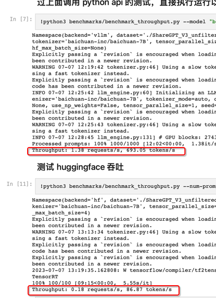

# vllm-cn
----
根据 [vllm 测试结果]()，vllm 能极大提高大语言模型推理阶段的吞吐性能，这对计算资源有限，受限于推理效率的一些情况来说无疑是一大福音

但是截止 2023.7.8，[vllm 文档](https://vllm.readthedocs.io/en/latest/models/supported_models.html) 显示其尚未支持目前热度较高的一些中文大模型，比如 baichuan-inc/baichuan-7B, THUDM/chatglm-6b

于是本人在另一个 [repo](https://github.com/gameofdimension/vllm) 实现了 vllm 对 baichuan-inc/baichuan-7B 的支持。运行官方的测试脚本，确实也可以看到 5+ 倍的效率提升。目前代码已向官方提交 PR 期望能合并到官方代码

### 测试

baichuan-inc/baichuan-7B 的 vllm 适配测试可参考 [这里]()。也可直接 colab 运行，但是因为模型较大，需要选用 A100 gpu 或者更高配置

### 下一步
- [ ] 支持 chatglm, moss 等其他中文大语言模型
- [ ] 实现张量并行(tensor parallel)。但是苦于本人 gpu 资源有限，何时能完成有很大不确定性

### 感谢

- [NLP（十七）：从 FlashAttention 到 PagedAttention, 如何进一步优化 Attention 性能](https://zhuanlan.zhihu.com/p/638468472)
- [Adding a New Model](https://vllm.readthedocs.io/en/latest/models/adding_model.html)